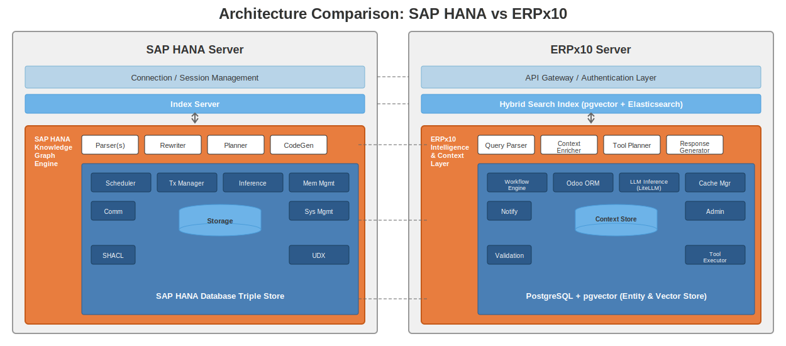

# SAP HANA vs ERPx10 Architecture Comparison

## Visual Comparison



## Component Mapping

| SAP HANA Component | ERPx10 Equivalent | Purpose |
|--------------------|-------------------|---------|
| **Connection/Session Management** | **API Gateway / Auth Layer** | Handles authentication, rate limiting, session tokens |
| **Index Server** | **Hybrid Search Index** | Query routing, search optimization, vector + keyword search |
| **Knowledge Graph Engine** | **Intelligence & Context Layer** | Core AI/ML processing engine |

### Processing Pipeline

| SAP HANA | ERPx10 | Function |
|----------|--------|----------|
| Parser(s) | Query Parser | Parse natural language or structured queries |
| Rewriter | Context Enricher | Add contextual information, expand abbreviations |
| Planner | Tool Planner | Determine execution strategy, select tools |
| CodeGen | Response Generator | Generate final output (SQL vs natural language) |

### Runtime Components

| SAP HANA | ERPx10 | Function |
|----------|--------|----------|
| Scheduler | Workflow Engine | Schedule and orchestrate tasks |
| Tx Manager | Odoo ORM | Transaction management, ACID compliance |
| Inference | LLM Inference (LiteLLM) | ML model execution |
| Mem Mgmt | Cache Manager | Memory/cache optimization |
| Comm | Notify | External communication (WhatsApp, email) |
| Storage | Context Store | Persistent storage for context/state |
| Sys Mgmt | Admin | System administration interface |
| SHACL | Validation | Schema/data validation |
| UDX | Tool Executor | User-defined extensions/tools |

### Data Store

| SAP HANA | ERPx10 | Function |
|----------|--------|----------|
| Triple Store (RDF) | PostgreSQL + pgvector | Entity relationships, vector embeddings |

## Key Architectural Differences

| Aspect | SAP HANA | ERPx10 |
|--------|----------|--------|
| **Query Language** | SPARQL/SQL | Natural Language + Tool Calls |
| **Data Model** | RDF Triples | Relational + Vector Embeddings |
| **Inference Engine** | Built-in Graph Reasoning | External LLM (Claude, GPT) |
| **Extensibility** | UDX (C++/Java) | Python Tool Functions |
| **Deployment** | On-premise/Cloud SAP | Docker + PostgreSQL |
| **License** | Commercial | Open Source (Odoo Community) |
| **Cost** | $$$$$$ | $ (LLM API costs only) |

## Architecture Philosophy

### SAP HANA Knowledge Graph
- **Graph-first**: RDF triples as primary data model
- **SPARQL queries**: Structured graph traversal
- **Built-in reasoning**: SHACL validation, inference rules
- **Enterprise-grade**: Designed for massive scale

### ERPx10 Intelligence Layer
- **LLM-first**: Natural language as primary interface
- **Tool-based**: Function calling for data access
- **External reasoning**: LLM handles logic
- **Modular**: Composable tools and agents

## When to Choose Each

| Use Case | Recommended |
|----------|-------------|
| Complex graph queries (multi-hop relationships) | SAP HANA |
| Natural language interface for business users | ERPx10 |
| Strict ontology requirements | SAP HANA |
| Rapid prototyping and iteration | ERPx10 |
| Existing SAP ecosystem | SAP HANA |
| Odoo-based ERP | ERPx10 |
| Budget-constrained | ERPx10 |
| Enterprise compliance requirements | SAP HANA |

## Hybrid Approach

ERPx10 can incorporate knowledge graph capabilities:

```
┌─────────────────────────────────────────────────┐
│              ERPx10 + Graph Layer               │
├─────────────────────────────────────────────────┤
│  Natural Language → LLM → Tool Selection        │
│                        ↓                        │
│  ┌─────────────┐  ┌─────────────┐              │
│  │ Vector DB   │  │ Graph DB    │              │
│  │ (pgvector)  │  │ (Neo4j/     │              │
│  │             │  │  Apache AGE)│              │
│  └─────────────┘  └─────────────┘              │
│         ↓                ↓                      │
│      Semantic         Graph                     │
│      Search          Traversal                  │
│         ↓                ↓                      │
│            Combined Results                     │
│                   ↓                             │
│           LLM Summarization                     │
└─────────────────────────────────────────────────┘
```

This hybrid approach gives ERPx10:
- Natural language interface (LLM)
- Semantic search (pgvector)
- Graph reasoning (Neo4j/AGE)
- Best of both worlds
